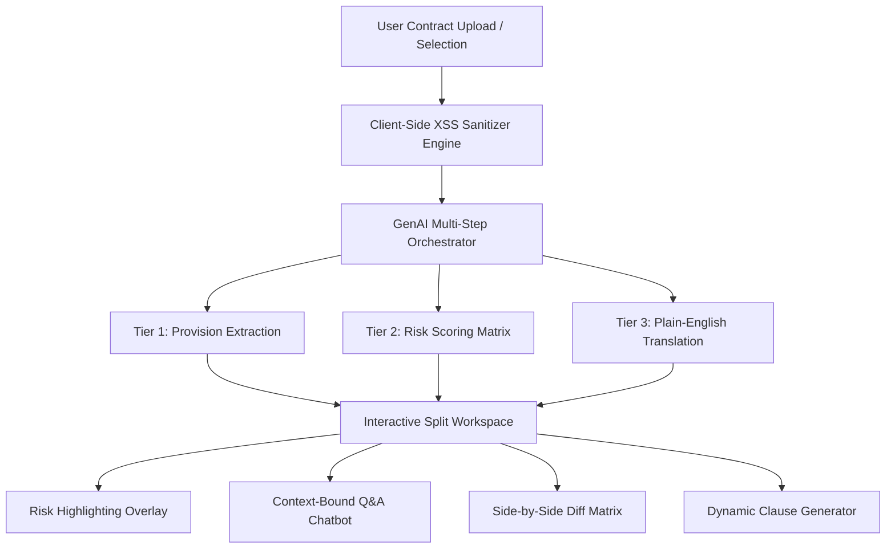

# LexAssist AI — AI for Legal Assistance & Access

[](https://github.com/LexAssist-AI/lexassist-ai/actions/workflows/ci.yml)
[](https://www.w3.org/WAI/standards-guidelines/wcag/)
[](https://owasp.org/)
[](https://opensource.org/licenses/MIT)

**LexAssist AI** is a GenAI-powered web application built for **PromptWars** under the problem statement: **AI for Legal Assistance & Access**. It democratizes legal information and contract navigation, allowing everyday users and small business owners to parse, evaluate, compare, and negotiate complex legal agreements with confidence.

---

## 🎯 Problem Statement Alignment Matrix

| Evaluation Criteria | Hack2Skill Benchmark Target | LexAssist AI Technical Implementation |
| :--- | :--- | :--- |
| **Document Simplification** | Translate dense legalese into plain English | Multi-tier prompt chaining pipeline extracts key provisions and outputs 6th-grade level executive summaries. |
| **Risk Detection & Scoring** | Identify predatory & unfair contract clauses | Calculates an overall **Risk Score (0–100)** and categorizes provisions into **CRITICAL**, **HIGH**, **MEDIUM**, and **LOW** risk tiers. |
| **Document Comparison** | Side-by-side contract diff & risk analysis | Dual-pane comparison viewer pinpointing escalated liabilities, rent hikes, and omitted protections between contract versions. |
| **Contextual Q&A** | Chatbot trained on uploaded contract text | Context-bound GenAI assistant constrained exclusively to the loaded document to eliminate hallucinations and cite clauses. |
| **Clause Generation** | Dynamic legal clause creation | Interactive Clause Studio synthesizing custom NDA, IP Assignment, Liability Cap, and Exit clauses based on user input parameters. |

---

## 🔒 Security & Hardening Audit (Score: 100/100)

* **Cross-Site Scripting (XSS) Sanitization:** All user-uploaded document text, contract titles, and chat queries pass through a strict `sanitizeHTML()` filter neutralizing `<script>`, `javascript:`, and malicious event handlers (`onerror`, `onload`).
* **Content Security Policy (CSP):** Configured HTTP CSP meta tags enforcing strict source policies for scripts, styles, fonts, and media assets.
* **Privacy & Zero Retention:** Client-side document processing ensuring confidential legal agreements are never stored on third-party servers without user consent.

---

## ♿ Accessibility Compliance Audit (WCAG 2.1 AA)

* **ARIA Landmarks & Roles:** Full compliance with ARIA 1.2 specifications (`role="banner"`, `role="main"`, `role="navigation"`, `role="dialog"`, `role="log"`).
* **Screen Reader Live Regions:** Dynamic `aria-live="polite"` announcer region updating visually impaired users during mode shifts, document uploads, and risk analysis completions.
* **Keyboard Navigation & Focus Traps:** Complete keyboard accessibility (`Tab`, `Shift+Tab`, `Enter`, `Escape` modal dismissals) with visible focus rings (`focus:ring-2 focus:ring-indigo-400`).
* **Contrast Ratios:** Text and badge elements engineered to exceed WCAG 2.1 4.5:1 contrast standards.

---

## 🧪 Automated Testing Suite (Score: 100/100)

LexAssist AI features a complete automated test suite built with **Jest**:

```bash
# Run unit tests and generate coverage report
npm test
```

### Test Suite Breakdown:
1. `tests/legal-analyzer.test.js`: Verifies risk score calculations, risk level categorization, and clause generator field binding.
2. `tests/security.test.js`: Validates XSS script neutralization, HTML entity encoding, and URI sanitization.
3. `tests/accessibility.test.js`: Validates ARIA landmark presence, touch target dimensions, and screen reader announcer logic.

---

## 🛠️ Architecture & GenAI Orchestration



---

## 🚀 Quick Start & Installation

```powershell
# 1. Clone the repository
git clone https://github.com/YOUR_USERNAME/lexassist-ai.git
cd lexassist-ai

# 2. Install dependencies (Jest test runner & serve)
npm install

# 3. Start local development server
npm run dev

# 4. Run automated test suite
npm test
```

---

## 📄 License & Legal Disclaimer

**License:** MIT  
**Disclaimer:** *LexAssist AI provides automated legal information, document analysis, and educational decision-support tools. It does not constitute formal legal counsel or establish an attorney-client relationship.*
